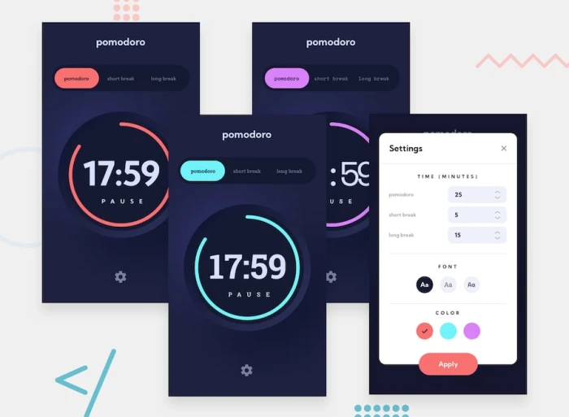

# Frontend Mentor - Pomodoro app solution

This is a solution to the [Pomodoro app challenge on Frontend Mentor](https://www.frontendmentor.io/challenges/pomodoro-app-KBFnycJ6G). Frontend Mentor challenges help you improve your coding skills by building realistic projects.

### The challenge

Users should be able to:

- Set a pomodoro timer and short & long break timers
- Customize how long each timer runs for
- See a circular progress bar that updates every minute and represents how far through their timer they are
- Customize the appearance of the app with the ability to set preferences for colors and fonts

### Preview

### Links
- Live Site URL: [Demo](https://pomodoro-six-psi.vercel.app/)

### Built with

- React
- TypeScript
- [Mui](https://mui.com/) 
- [Vite](https://vitejs.dev/)
- Scss
- Eslint
- Stylelint
- Prettier

## Author

- Website - [nagornykh.me](https://nagornykh.me/)
- Frontend Mentor - [@Ex-Zy](https://www.frontendmentor.io/profile/Ex-Zy)
